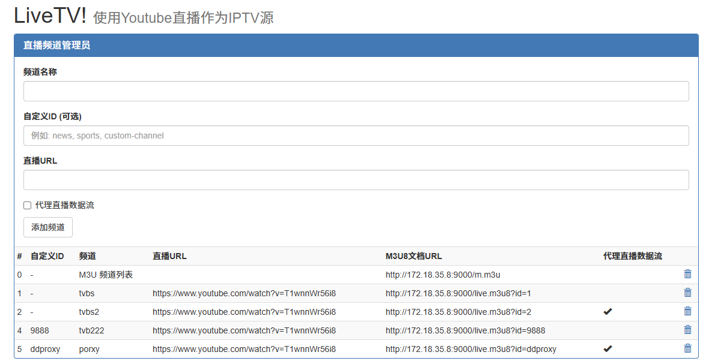

# LiveTV

将Youtube直播作为IPTV电视源

## 安装方法

首先你需要安装Docker，Centos7用家可以直接使用参考这篇教学文档：[How To Install and Use Docker on CentOS 7](https://www.digitalocean.com/community/tutorials/how-to-install-and-use-docker-on-centos-7)

安装好Docker后，只需要使用以下命令即可在本地的9000连接启用LiveTV！

`docker run -d -p9000:9000 juestnow/livetv:latest`

`ghcr.io/qist/livetv:latest`

数据档存储于容器内的`/root/data`目录中，所以建议使用-v指令将这个目录映像到宿主机的目录。

一个使用外部储存目录的例子如下。

`docker run -d --name youtube --restart=always -p9000:9000 -v/mnt/data/livetv:/root/data juestnow/livetv:latest`

` docker run -d --name youtube --restart=always --net=host  -v/opt/data/livetv:/root/data ghcr.io/qist/livetv:latest`


这将在9000连接开启一个使用`/mnt/data/livetv`目录作为存储的LiveTV！容器。

PS:如果不指定外部存储目录，LiveTV！重新启动时将无法读取之前的设定档。

## 使用方法

默认的登入密码是“password”，为了你的安全请及时修改。

首先你要知道如何在外界访问到你的主机，如果你使用VPS或者独立服务器，可以访问`http://你的主机ip:9000`，你应该可以看到以下画面：



首先你需要在设定区域点击“自动填充”，设定正确的URL。然后点击“储存设定”。

然后就可以添加频道，频道添加成功后就能M3U8档案列的地址进行播放了。

当你使用Kodi之类的播放器，可以考虑使用第一行的M3U档案URL进行播放，会自动生成包含所有频道信息的播放列表。

yt-dlp的文档可以在这里找到=> [https://github.com/yt-dlp/yt-dlp](https://github.com/yt-dlp/yt-dlp)

## Cookies 获取与配置

当部分频道需要登录才能访问时，可以配置 cookies 让 yt-dlp 正常拉流。

### 如何获取 cookies.txt（Netscape 格式）
1. 使用浏览器登录目标网站（如 YouTube）。
2. 安装浏览器扩展导出 cookies，例如“Get cookies.txt”或“Cookie-Editor”。
3. 使用 Cookie-Editor 时，切换到 YouTube 页面，点击右下角的 Export，复制导出的内容（Netscape 格式）。
4. 将复制内容粘贴到“yt-dlp Cookies 内容”。

### 在 LiveTV 中配置
1. 打开设置页的 “yt-dlp Cookies 内容（可选）”。
2. 将 cookies.txt 的内容粘贴到文本框并保存。
3. 留空并保存即可禁用 cookies。

### 安全说明
- cookies 会保存为数据目录下的 `cookies.txt`，权限为 600。
- 仅支持由页面粘贴内容生成文件，不支持自定义路径或上传文件，避免路径风险。

## 新功能

### 1. M3U 播放列表文件名自定义
- 默认值: `lives.m3u`
- 可在配置管理部分自定义
- 更改立即生效，无需重启服务器

### 2. 频道参数自定义
- 默认值: `c` (例如: `live.m3u8?c=1`)
- 可在配置管理部分自定义

### 3. 自定义频道 ID
- 支持为频道设置自定义字符串 ID (例如: "news", "sports")
- 每个频道可以有唯一的自定义 ID
- 在频道列表中显示

### 4. 日志输出模式
- 默认: 仅标准输出
- 环境变量 `LIVETV_LOG_FILE=1` 启用文件日志
- 日志存储在 `./data/livetv.log`

### 5. 定时缓存错误处理
- 跟踪失败的频道
- 连续失败 3 次后将频道放入冷却期
- 24 小时冷却期后自动重试

### 6. 自动目录创建
- 如果数据目录不存在则创建
- 确保日志和数据库的正确存储结构

### 7. 版本号
- 启动时显示版本信息
- 当前版本: 1.0.0

nginx 代理设置

```nginx
upstream  youtube {
        least_conn;
        server 127.0.0.1:9000 max_fails=3 fail_timeout=30s;
        keepalive 1000;
}

server {
    listen 80;
    server_name www.xxx.com;
     location / {
        proxy_pass http://youtube;
        proxy_redirect     off;
        proxy_set_header   Host $host;
        proxy_set_header   X-Real-IP    $remote_addr;
        proxy_set_header   X-Forwarded-For  $proxy_add_x_forwarded_for;
        proxy_next_upstream error timeout invalid_header http_502 http_503 http_504;
        proxy_max_temp_file_size 0;
        proxy_connect_timeout      90;
        proxy_send_timeout         90;
        proxy_read_timeout         90;
        proxy_buffer_size          4k;
        proxy_buffers              4 32k;
        proxy_busy_buffers_size    64k;
        proxy_temp_file_write_size 64k;
        proxy_http_version 1.1;
        proxy_set_header Accept-Encoding "";
   }
}
```
